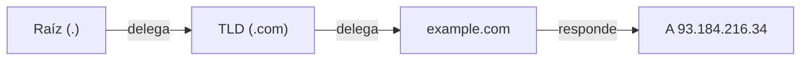
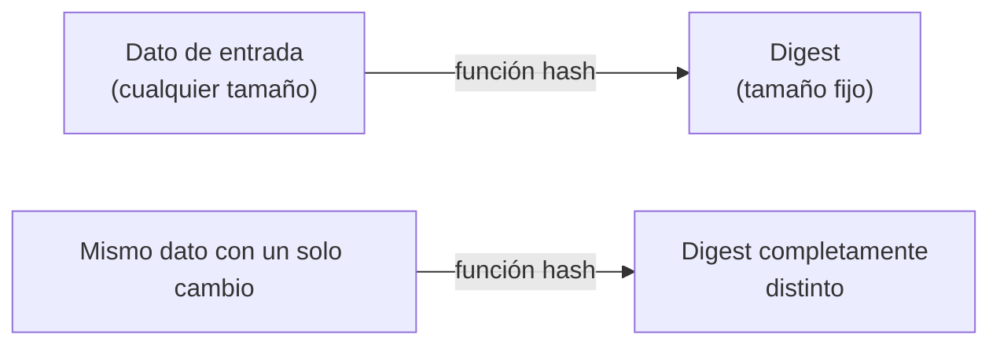
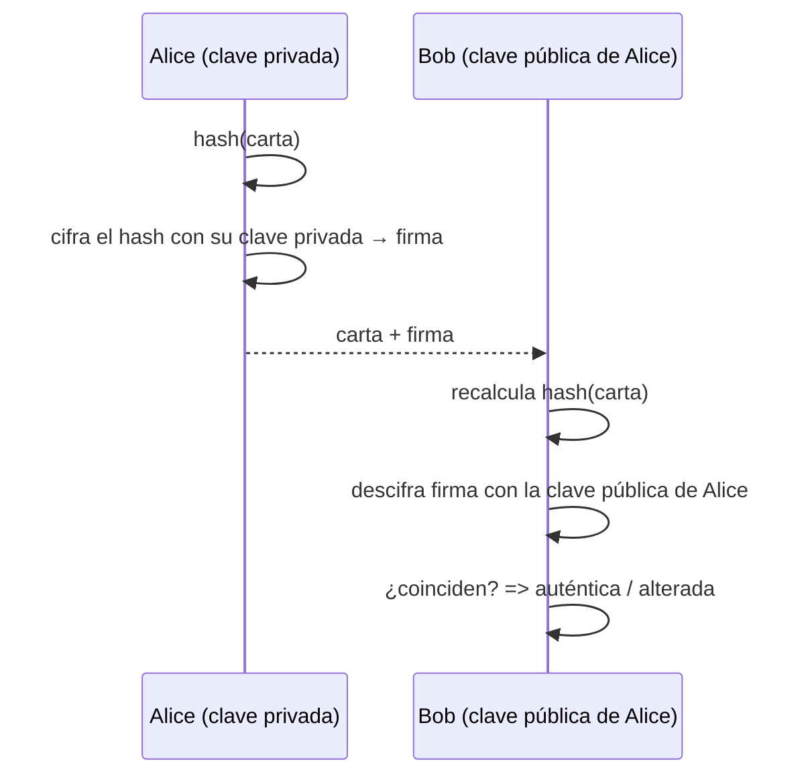
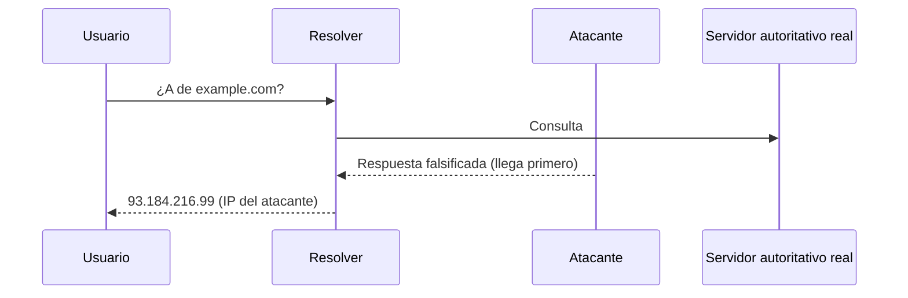
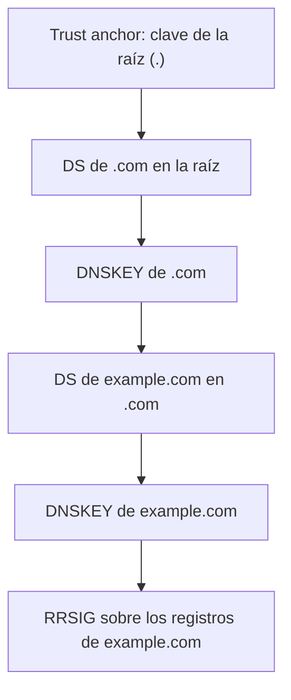

# 01 - Introducción a DNSSEC

## Repaso breve de DNS

DNS traduce nombres (`example.com`) a datos (direcciones IP, entre otras cosas). Los datos se organizan en **zonas**, cada zona tiene un archivo con **RRsets** (conjuntos de registros del mismo nombre y tipo).

Ejemplo simplificado de una zona `example.com` sin firmar:

```zone
example.com.        3600  IN  SOA   ns1.example.com. admin.example.com. (
                                     2026071001 ; serial
                                     3600       ; refresh
                                     600        ; retry
                                     1209600    ; expire
                                     3600 )     ; minimum
example.com.        3600  IN  NS    ns1.example.com.
example.com.        3600  IN  NS    ns2.example.com.
example.com.        3600  IN  A     93.184.216.34
www.example.com.    3600  IN  CNAME example.com.
```

Las zonas se **delegan**: la zona raíz (`.`) delega `com.` a los servidores del TLD, y `com.` delega `example.com.` a los servidores del dominio. Un resolver sigue esa cadena de delegaciones, servidor por servidor, hasta obtener la respuesta.



El problema: nada en este mecanismo prueba que una respuesta sea auténtica. Un resolver acepta lo que recibe.

## Fundamentos de criptografía

Antes de seguir, tres conceptos que DNSSEC usa todo el tiempo.

### Criptografía

Conjunto de técnicas matemáticas para proteger información: garantizar que solo cierta parte pueda leerla (confidencialidad), o que se pueda comprobar su origen e integridad (autenticidad). DNSSEC usa la segunda rama — no cifra datos, los **firma**.

### Criptografía de clave pública

En criptografía simétrica hay una sola clave, compartida entre las partes, que sirve tanto para cifrar como para descifrar. Eso no funciona en DNS: no hay forma de compartir un secreto con millones de resolvers sin exponerlo.

La criptografía de clave pública (asimétrica) usa un **par de claves** matemáticamente relacionadas:

- una **clave privada**, secreta, que se usa para firmar,
- una **clave pública**, distribuida libremente, que se usa para verificar.

Lo que se firma con una clave privada, solo se verifica con su clave pública correspondiente. Nadie necesita conocer la clave privada para confiar en lo firmado — solo la clave pública, que puede publicarse sin problema. Esto es lo que hace viable el modelo: la clave pública de una zona se publica en la propia zona (registro DNSKEY, ver [módulo 2](02-Registros.md)).

### Hashes (digest / resumenes)

Un **hash** (o *digest*) es el resultado de aplicar una función matemática a un dato de cualquier tamaño, produciendo una salida de tamaño fijo. Las funciones de hash criptográficas usadas en DNSSEC (SHA-256, SHA-1 en desuso) tienen tres propiedades clave:

- **Determinismo**: el mismo dato siempre produce el mismo hash.
- **Efecto avalancha**: cambiar un solo bit del dato de entrada cambia por completo el hash resultante — no hay forma de predecir el hash a partir de una modificación pequeña.
- **Resistencia a colisiones y a preimagen**: es computacionalmente inviable encontrar dos datos distintos con el mismo hash, o reconstruir el dato original a partir de su hash.

Esto hace que un hash sirva como "huella digital" de un dato: no se puede usar para reconstruirlo, pero cualquier alteración del original es detectable comparando hashes.



Un ejemplo concreto. Este haiku:

```
Sobre la rama
una hoja de otoño
cae en silencio
```

tiene estos hashes:

| Algoritmo | Hash                                       |
| --------- | ------------------------------------------- |
| MD5       | `c5f12d2a6fe419e912c9e57296792872`           |
| SHA-1     | `13c3b99562aa840a4b95aa080e8add1fcfb02609`   |

Si le agregamos un solo punto al final ("...silencio.") — un cambio mínimo, invisible a simple vista si no se compara con cuidado — los hashes son completamente distintos:

| Algoritmo | Hash                                       |
| --------- | ------------------------------------------- |
| MD5       | `27ae6b2b4c1808e8df03f92a06b31a43`           |
| SHA-1     | `2e4b10306f75266216133fbfd0cd503021ac6c42`   |

Ningún patrón conecta ambos hashes — ese es el efecto avalancha en acción. (Nota al margen: MD5 y SHA-1 aparecen aquí solo con fines ilustrativos; ambos están **rotos** para uso criptográfico — se conocen ataques de colisión práctica. DNSSEC usa SHA-256 o superior.)

DNSSEC usa hashes en dos lugares distintos: para reducir un RRset a un resumen antes de firmarlo (ver [Firma digital](#firma-digital) abajo), y para el registro DS, que es literalmente el hash de una clave DNSKEY publicado en la zona padre — así el padre certifica la clave del hijo sin tener que republicarla entera (ver [módulo 2](02-Registros.md)).

### Firma digital

Firmar un dato no es lo mismo que cifrarlo. El ejemplo clásico: Alice quiere enviarle una carta a Bob, y Bob quiere poder comprobar que realmente la escribió Alice y que nadie la alteró en el camino.

1. Alice calcula un **hash** de su carta (un resumen de tamaño fijo; cualquier cambio en el texto cambia completamente el hash).
2. Alice cifra ese hash con su **clave privada** — el resultado es la firma, que envía junto con la carta.
3. Bob, con la **clave pública** de Alice, descifra la firma y recalcula el hash de la carta recibida. Si ambos hashes coinciden, la carta es auténtica y no fue alterada; si no coinciden, algo cambió — o no la firmó Alice.



Este es exactamente el mecanismo que DNSSEC aplica a los RRsets de una zona, empaquetado en un registro RRSIG. Con esta base, firmar una zona y validar una respuesta ya tienen un sentido concreto.

## ¿Qué es DNSSEC?

DNSSEC (Domain Name System Security Extensions) es un conjunto de extensiones al protocolo DNS que aplica firma digital a las respuestas. No cifra nada — cualquiera puede seguir leyendo el tráfico DNS — pero permite a un resolver **validar** que una respuesta:

- fue generada por el dueño legítimo de la zona (autenticidad), y
- no fue modificada en tránsito (integridad).

Esto se logra firmando los RRsets con la clave privada de la zona y publicando la clave pública correspondiente en la propia zona, más un enlace hacia el padre que certifica esa clave. El detalle de los registros involucrados se ve en el [módulo 2](02-Registros.md).

## ¿Qué problemas resuelve?

El caso clásico es el **cache poisoning** (ataque Kaminsky, 2008): un atacante que logra adivinar o inyectar una respuesta falsa antes de que llegue la legítima puede envenenar la caché de un resolver, redirigiendo a los usuarios a servidores maliciosos sin que noten nada.



Con DNSSEC, el resolver valida la firma de la respuesta contra la cadena de confianza. Si la respuesta del atacante no está firmada correctamente (no tiene la clave privada de `example.com`), la validación falla y el resolver la descarta.

En términos generales, DNSSEC protege contra cualquier escenario donde un tercero (on-path o fuera de camino) intenta **suplantar o alterar** respuestas DNS: spoofing, envenenamiento de caché, ataques de intermediario sobre resoluciones no cifradas.

## ¿Qué NO resuelve DNSSEC?

Es igual de importante entender los límites:

- **No es una solución para brindar confidencialidad.** Las consultas y respuestas siguen viajando en texto claro; cualquiera que observe el tráfico ve qué se consulta. Para eso existen DoT/DoH/DoQ, que son ortogonales a DNSSEC.
- **No protege contra DDoS.** Un servidor autoritativo o un resolver saturado sigue siendo vulnerable a ataques de denegación de servicio.
- **No garantiza disponibilidad.** Si la firma expira o hay un error de configuración, el efecto es que las respuestas se vuelven *inválidas*, no que dejen de existir — un resolver validador simplemente las rechaza (posible caída del servicio si no se opera bien).
- **No valida el contenido en sí**, solo que el contenido no fue alterado desde que el dueño de la zona lo firmó. Si el dueño de la zona publica un registro incorrecto, DNSSEC lo firma igual.

## Cadena de confianza

La validación funciona porque existe una cadena continua desde un **ancla de confianza** (la clave pública de la zona raíz, distribuida fuera de banda) hasta la zona que se está consultando. Cada eslabón certifica al siguiente:



Si en algún eslabón la cadena se rompe (falta un DS, una firma expiró, una clave no coincide), la validación falla para toda la zona y todo lo que cuelga debajo de ella.

## Conceptos clave

| Término   | Significado breve                                                                        |
| --------- | ---------------------------------------------------------------------------------------- |
| Hash      | Resumen (_digest/hash_) de tamaño fijo de un dato; cambia por completo si el dato cambia |
| Validador | Resolver que verifica firmas antes de aceptar una respuesta                              |
| RRset     | Conjunto de registros del mismo nombre y tipo (lo que se firma como unidad)              |

KSK, ZSK y los tipos de registro específicos de DNSSEC se cubren en detalle en el próximo módulo.

## Resumen

- La firma digital con criptografía de clave pública es la base técnica de DNSSEC: clave privada firma, clave pública verifica.
- DNSSEC agrega autenticidad e integridad a las respuestas DNS, no confidencialidad ni disponibilidad.
- Resuelve ataques de suplantación/envenenamiento de caché mediante firmas verificables.
- Depende de una cadena de confianza ininterrumpida desde la raíz hasta la zona consultada.
- Siguiente: [02-Registros.md](02-Registros.md) — los registros concretos que hacen esto posible.
