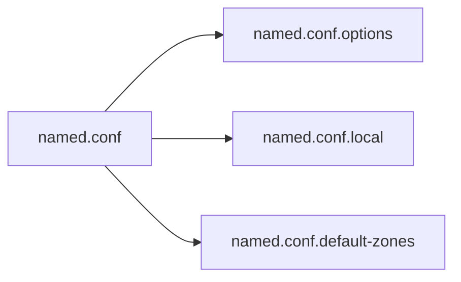
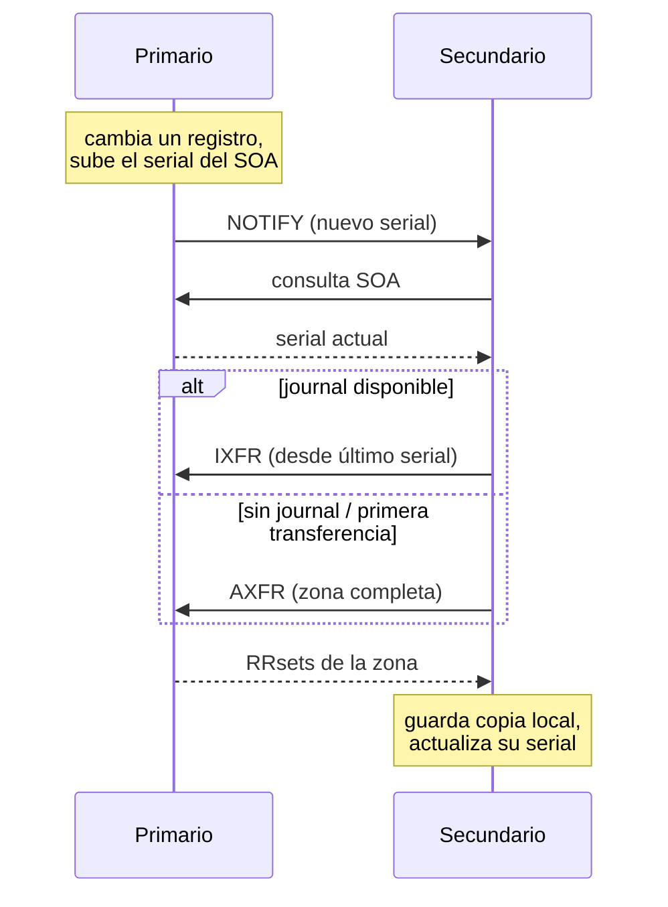

# 03 - Zonas autoritativas con BIND

Hasta ahora vimos DNSSEC en abstracto: qué problema resuelve y qué registros usa. Antes de firmar nada hace falta un servidor autoritativo funcionando. Este módulo levanta ese servidor con BIND 9 sobre Ubuntu — sin firma todavía, eso es el [módulo 4](04-Firmando-con-BIND-y-KASP.md). Vamos a publicar la misma zona `example.com` que usamos como ejemplo en el [módulo 1](01-Introduccion.md), ahora en un servidor real.

## Instalando BIND 9 en Ubuntu

```
$ sudo apt update
$ sudo apt install bind9 bind9utils bind9-dnsutils
```

- `bind9` — el propio servidor (`named`).
- `bind9utils` — herramientas de administración: `rndc`, `named-checkzone`, `named-checkconf`, `dnssec-*` (estas últimas se usan recién en el módulo 4).
- `bind9-dnsutils` — `dig`, `nslookup`, `delv`.

Verificación básica:

```
$ named -v
BIND 9.18.28 (Extended Support Version) <id:...>

$ systemctl status bind9
● bind9.service - BIND Domain Name Server
     Active: active (running)
```

Un detalle propio de Ubuntu: BIND corre bajo AppArmor con un perfil que restringe a qué directorios puede acceder `named` (por defecto `/etc/bind`, `/var/cache/bind`, `/var/lib/bind`). Si más adelante movés zonas a otra ruta, hay que actualizar el perfil (`/etc/apparmor.d/usr.sbin.named`) o vas a ver errores de permiso que no aparecen en `named.conf` sino en el log de AppArmor (`journalctl -k | grep apparmor`).

## Repaso del layout de configuración en Ubuntu

Ubuntu separa la configuración de BIND en varios archivos, todos bajo `/etc/bind/`:

| Archivo | Contenido |
| --- | --- |
| `named.conf` | Solo tres líneas `include` hacia los archivos de abajo — no se edita directamente |
| `named.conf.options` | Opciones globales del servidor: recursión, listen-on, forwarders, etc. |
| `named.conf.local` | Donde se declaran las zonas propias (lo que vamos a editar en este módulo) |
| `named.conf.default-zones` | Zonas que Ubuntu preconfigura: `localhost`, reversa de loopback, `root.hints` |



Los datos viven aparte de la configuración:

- `/var/cache/bind/` — directorio de trabajo por defecto (`directory` en `named.conf.options`). Ahí van los archivos de zona, journals (`.jnl`) y las zonas transferidas de un primario.
- `/etc/bind/rndc.key` — clave usada por `rndc` (la herramienta de control remoto de `named`) para autenticarse contra el servidor. Detalle de configuración y errores comunes, a continuación.

## Configurando rndc

`rndc` es el canal por el que se le habla a `named` en caliente (`reload`, `retransfer`, `freeze`, etc.) — no es un simple wrapper de línea de comandos, es un cliente que se conecta por TCP (puerto 953 por defecto) a un canal de control separado del propio DNS, autenticado con una clave compartida en vez de usuario/contraseña. Vale la pena mirarlo de cerca antes de depender de él, porque en la práctica es de lo primero que falla en una instalación nueva.

**Qué trae Ubuntu por defecto.** El paquete `bind9` genera la clave automáticamente al instalarse (`/etc/bind/rndc.key`), y `named.conf` la incluye:

```
$ cat /etc/bind/named.conf
include "/etc/bind/rndc.key";
include "/etc/bind/named.conf.options";
include "/etc/bind/named.conf.local";
include "/etc/bind/named.conf.default-zones";
```

Si no declarás un bloque `controls` explícito en `named.conf.options`, `named` abre igual, por comportamiento por defecto, un canal de control en `127.0.0.1:953` usando esa clave. Por eso `rndc reload` local suele andar apenas instalado el paquete — pero "andar" acá tiene requisitos que no siempre están cubiertos:

```
$ ls -l /etc/bind/rndc.key
-rw-r----- 1 bind bind 77 ago  4 10:00 /etc/bind/rndc.key
```

El archivo es legible solo por `root` y por el grupo `bind`. Si corrés `rndc` como un usuario normal sin `sudo`, va a fallar — y el mensaje de error no dice "permiso denegado", dice algo más genérico:

```
$ rndc reload
rndc: connection to remote host closed
This may indicate that
* the remote server is using an older/higher version of rndc protocol,
* this host is not authorized to connect,
* the clocks are not synchronized, or
* the connection key is invalid.
```

Ese mismo mensaje aparece por varias causas distintas, en orden de probabilidad cuando algo que "debería andar solo" no anda:

1. **Falta de permisos para leer la clave** — el caso más común. Solución: `sudo rndc reload`, o agregar el usuario al grupo `bind` (`sudo usermod -aG bind $USER`, requiere volver a loguear).
2. **Reloj desincronizado** — `rndc` firma el mensaje con timestamp; un desfase grande entre cliente y servidor invalida la firma aunque la clave sea correcta. Si lo anterior no era el problema, revisar `timedatectl`.
3. **La clave de `named.conf` y la de quien corre `rndc` no coinciden** — típicamente porque alguien regeneró `/etc/bind/rndc.key` a mano, o editó el bloque `controls`/`key`, y quedó desactualizado en un lado.

**Regenerar la clave** (por ejemplo, para pasar del HMAC-MD5 que trae por defecto en instalaciones viejas a algo más fuerte):

```
$ sudo rndc-confgen -a -A hmac-sha256
$ sudo systemctl restart bind9
```

`rndc-confgen -a` sobreescribe `/etc/bind/rndc.key` directamente — no hace falta tocar `named.conf.options` a mano si vas a seguir controlando el servidor solo desde localhost.

**Habilitar rndc desde otra máquina.** Este es el caso que efectivamente hace falta para el `rndc retransfer` de la próxima sección, si el primario y el secundario están en hosts distintos: el canal de control, por default, solo escucha en loopback. Nada externo puede hablarle a `named` aunque tenga la clave correcta — hay que declarar `controls` explícitamente en `named.conf.options` **del servidor que se quiere controlar**:

```
controls {
    inet 192.0.2.2 port 953
        allow { 203.0.113.10; } keys { "rndc-key"; };
};
```

Y en la máquina desde la que se va a correr `rndc` (un host de administración, o el propio secundario apuntando a sí mismo) hace falta un `/etc/bind/rndc.conf` — que Ubuntu no genera por default, hay que crearlo:

```
# /etc/bind/rndc.conf
key "rndc-key" {
    algorithm hmac-sha256;
    secret "misma-clave-base64-que-en-rndc.key==";
};

options {
    default-server 192.0.2.2;
    default-key "rndc-key";
};
```

El secreto tiene que ser textualmente el mismo que en el `/etc/bind/rndc.key` del servidor controlado. Con esto, `rndc -s 192.0.2.2 reload example.com` ya no depende de un `rndc.key` local — usa lo declarado en `rndc.conf`.

## Crear una zona autoritativa primaria

En `named.conf.local`:

```
zone "example.com" {
    type primary;
    file "/etc/bind/db.example.com";
};
```

(En versiones viejas de BIND — y en gran parte de la documentación dando vueltas — vas a ver `type master;` en vez de `type primary;`. Son sinónimos; `primary`/`secondary` es la terminología actual.)

Archivo de zona `/etc/bind/db.example.com`, coherente con el que vimos sin firmar en el módulo 1:

```zone
$TTL 3600
example.com.        IN  SOA   ns1.example.com. admin.example.com. (
                                     2026080401 ; serial
                                     3600       ; refresh
                                     600        ; retry
                                     1209600    ; expire
                                     3600 )     ; minimum
example.com.        IN  NS    ns1.example.com.
example.com.        IN  NS    ns2.example.com.
ns1.example.com.    IN  A     192.0.2.1
ns2.example.com.    IN  A     192.0.2.2
example.com.        IN  A     93.184.216.34
www.example.com.    IN  CNAME example.com.
```

Antes de recargar, validar sintaxis:

```
$ named-checkzone example.com /etc/bind/db.example.com
zone example.com/IN: loaded serial 2026080401
OK

$ named-checkconf
```

`named-checkconf` sin salida es éxito. Si algo está mal, avisa con el archivo y número de línea exacto — conviene correrlo siempre antes de recargar, cuesta un segundo y evita tirar el servicio con una zona rota.

Recargar y confirmar que `named` la tomó:

```
$ sudo rndc reload
zone reload successful

$ journalctl -u named --since "1 min ago"
... zone example.com/IN: loaded serial 2026080401
```

## Verificar el funcionamiento con dig/drill

```
$ dig @127.0.0.1 example.com A +short
93.184.216.34

$ dig @127.0.0.1 example.com SOA +short
ns1.example.com. admin.example.com. 2026080401 3600 600 1209600 3600
```

`drill` (de `ldnsutils`, `apt install ldnsutils`) es una alternativa más compacta a `dig`, útil más adelante para inspeccionar DNSSEC:

```
$ drill @127.0.0.1 example.com A
;; ->>HEADER<<- opcode: QUERY, rcode: NOERROR, id: ...
;; ANSWER SECTION:
example.com.    3600    IN  A   93.184.216.34
```

Si cualquiera de los dos falla, revisar en este orden: `named-checkzone` (sintaxis), `systemctl status bind9` (¿está corriendo?), `journalctl -u named` (mensaje de error concreto), y por último si el puerto 53 está escuchando (`ss -lntu | grep :53`).

## Configurar una zona autoritativa secundaria

**Por qué usar un secundario.** Un único servidor autoritativo es un punto único de falla — si se cae o queda inalcanzable, nadie puede resolver la zona, sin importar cuán bien esté firmada o configurada. Las buenas prácticas (RFC 2182) piden al menos dos servidores autoritativos, en redes y, preferentemente, ubicaciones distintas, para que la caída de uno no tire la zona entera. Como beneficio adicional, servidores dispersos geográficamente acortan la latencia para resolvers cercanos y reparten la carga de consultas.

**Cómo se mantienen sincronizados.** Un secundario no tiene un archivo de zona editado a mano — lo obtiene y actualiza por **transferencia de zona** desde el primario, disparada por dos mecanismos que suelen combinarse:

- **Polling por SOA**: cada `refresh` segundos (el valor del SOA que vimos en el módulo 1), el secundario le pregunta al primario su serial actual. Si es mayor al que tiene guardado, inicia una transferencia.
- **NOTIFY**: el primario avisa proactivamente al secundario apenas cambia el serial, en vez de que este último tenga que esperar el próximo poll — lo configuramos más abajo con `also-notify`/`notify yes`, y acorta la propagación de minutos/horas a segundos.

**El rol de AXFR.** La transferencia en sí ocurre mediante **AXFR** ("Authoritative Transfer"), un tipo de consulta DNS distinto de una consulta normal (A, MX, etc.): en vez de UDP, va por **TCP** — porque la respuesta puede ser arbitrariamente grande, toda la zona en un solo intercambio, algo que UDP no soporta bien — y en vez de devolver un RRset puntual, devuelve **la zona completa**, como una secuencia de mensajes DNS que empieza y termina con el registro SOA (eso le indica al receptor dónde arranca y dónde termina la transferencia). Es el mecanismo que arma la copia inicial del secundario, y al que se recurre si en algún momento pierde sincronía — por ejemplo, si el journal de IXFR (la variante incremental, que solo transfiere los cambios desde el último serial conocido) no está disponible.



En el `named.conf.local` del **secundario**:

```
zone "example.com" {
    type secondary;
    primaries { 192.0.2.1; };   // IP del servidor primario
    file "/var/cache/bind/example.com.secondary";
};
```

(`primaries` es el nombre actual del bloque; en configuraciones antiguas aparece como `masters`, mismo significado.)

**Los NS tienen que reflejar la topología real.** Fijate que `192.0.2.2` — la IP que le vamos a asignar al secundario — es la misma que ya le dimos a `ns2.example.com` en el archivo de zona del primario, al principio de este módulo. Eso no es casualidad: es el punto que hace que la alta disponibilidad primario/secundario funcione de verdad. Tener la zona sincronizada en el secundario no alcanza si nadie lo va a consultar — para eso, **tanto el primario como el secundario necesitan su propio registro NS, declarado en dos lugares**:

1. **En el archivo de zona** — ya lo tenemos: `NS ns1.example.com` y `NS ns2.example.com`, cada uno con su A correspondiente (`192.0.2.1` y `192.0.2.2`).
2. **En la zona padre** (registrador/TLD, cubierto al final de este módulo) — tiene que delegar a los dos, no solo al primario. Si el padre delega solo a `ns1`, `ns2` puede estar perfectamente sincronizado y aun así ser irrelevante: los resolvers nunca lo van a descubrir, porque nunca lo van a preguntar por él.

Sin los dos NS coherentes en ambos lugares, un "secundario" deja de ser alta disponibilidad real y pasa a ser, en el mejor de los casos, un respaldo manual que hay que promover a mano si el primario cae.

Con esto solo, la transferencia va a fallar — el primario, por defecto, no deja transferir la zona a nadie. Eso se resuelve en la sección siguiente.

Una vez habilitada la transferencia, confirmar en el secundario:

```
$ sudo rndc retransfer example.com
$ ls -la /var/cache/bind/example.com.secondary
$ dig @<ip-secundario> example.com SOA +short
```

Para ver el AXFR en crudo, tal cual lo recibe el secundario (una vez habilitado el permiso en la sección siguiente):

```
$ dig @192.0.2.1 example.com AXFR
```

El serial debe coincidir con el del primario. Si no aparece el archivo, revisar `journalctl -u named` en el secundario — ahí BIND registra explícitamente por qué rechazó o no pudo completar la transferencia.

### Permitir AXFR/IXFR de forma segura y controlada

En el **primario**, dentro del bloque de la zona (o globalmente en `named.conf.options` si aplica a todas):

```
acl "secundarios" {
    192.0.2.2;   // IP del secundario
};

zone "example.com" {
    type primary;
    file "/etc/bind/db.example.com";
    allow-transfer { key transfer-key; };
    also-notify { 192.0.2.2; };
    notify yes;
};
```

`also-notify` + `notify yes` hacen que el primario avise al secundario apenas cambia el serial, en vez de esperar a que el secundario pregunte por su cuenta según el `refresh` del SOA.

Restringir por IP (`allow-transfer { secundarios; };`) es un mínimo, pero una IP se puede falsificar. Para autenticar de verdad, TSIG (Transaction Signature — una clave simétrica compartida entre primario y secundario):

```
$ tsig-keygen transfer-key
key "transfer-key" {
    algorithm hmac-sha256;
    secret "base64...==";
};
```

Ese bloque se copia igual en ambos servidores (`named.conf.options` o un archivo incluido), y luego se referencia en `allow-transfer { key transfer-key; };` en el primario, y en el bloque `primaries` del secundario:

```
primaries { 192.0.2.1 key transfer-key; };
```

La elección entre AXFR e IXFR (vistas arriba) es automática: BIND prefiere IXFR si hay journal (`.jnl`) disponible, y solo recurre a AXFR completo si no lo hay — no hace falta configurar nada extra para que el secundario prefiera la incremental, es una negociación automática entre las dos partes. El `dig ... AXFR` manual sigue siendo útil para depurar o inspeccionar la zona completa, aunque el flujo normal en producción use IXFR la mayor parte del tiempo.

## Consideraciones de seguridad

### Prevenir la recursión no deseada

Un servidor autoritativo no debería resolver consultas recursivas para terceros. Mezclar los dos roles en la misma instancia es la fuente más común de servidores mal configurados (open resolvers), y agranda innecesariamente la superficie de ataque del servidor autoritativo. En `named.conf.options`:

```
options {
    recursion no;
    allow-recursion { none; };
    ...
};
```

Regla general: un servidor es **autoritativo** (responde solo por zonas que aloja) o **recursivo/resolver** (resuelve para clientes), nunca las dos cosas a la vez en producción.

### Prevenir las respuestas tomadas de caché no deseadas

El cache poisoning (visto en el módulo 1) ataca específicamente a resolvers que cachean respuestas de terceros para reusarlas. Un servidor autoritativo con `recursion no` ya no arma ese tipo de caché — es la primera y principal mitigación. Dos opciones complementarias, para cuando conviene ser explícito:

```
options {
    additional-from-cache no;
    additional-from-auth no;
};
```

Evitan que `named` complete secciones adicionales de una respuesta (glue, por ejemplo) usando datos que no vienen directamente de una zona que el servidor aloja — reduce todavía más la chance de que datos de terceros terminen filtrando en una respuesta autoritativa.

### Prevenir las transferencias de zona no deseadas

Por defecto, dejar `allow-transfer` abierto (o sin declarar en versiones viejas de BIND, que a veces default a "cualquiera") permite que cualquiera descargue la zona completa con un simple `dig axfr`. Dos problemas: expone toda la zona de una (reconocimiento fácil para un atacante) y permite que un tercero se pare como secundario no autorizado.

Buena práctica: negar por defecto a nivel global, permitir solo por excepción a nivel de zona:

```
options {
    allow-transfer { none; };
};

zone "example.com" {
    ...
    allow-transfer { key transfer-key; };
};
```

Combinando ACL/TSIG (sección anterior) con este default-deny, solo los secundarios explícitamente autorizados —y autenticados— pueden transferir.

## Comentarios sobre configurar los NS en la zona padre

Publicar `NS ns1.example.com` y `NS ns2.example.com` en la propia zona no alcanza: la zona **padre** (el registrador o el operador del TLD, según cómo esté delegado el dominio) necesita el mismo juego de NS para delegar correctamente. Dos puntos donde esto suele salir mal:

- **Glue records**: si el nombre del servidor NS está *dentro* de la zona que delega (`ns1.example.com` para la zona `example.com`), el padre necesita publicar también el registro A/AAAA de ese NS — si no, hay una referencia circular (para resolver `ns1.example.com` hace falta preguntarle a `ns1.example.com`). Esto se configura del lado del registrador, normalmente en una sección separada de "glue" o "servidores DNS" del panel de administración.
- **Coherencia de delegación**: el set de NS publicado en el padre y el publicado en la propia zona deben coincidir. Si difieren, es una delegación "lame" — algunos resolvers siguen la del padre, otros terminan confundidos, y el comportamiento puede ser inconsistente según qué servidor conteste primero.

Los cambios de NS en el padre suelen tardar en propagarse (TTL del propio registro NS/glue en el padre, más caché de resolvers ya en tránsito) — no es instantáneo, conviene planificarlo con margen si se está migrando de proveedor de DNS.

## Resumen

| Concepto | Qué logra |
| --- | --- |
| `rndc.key` + grupo `bind` | Autentica el control local de `named`; la causa más común de "rndc no anda" es no poder leer esta clave |
| `controls` + `rndc.conf` | Habilita y autentica el control remoto de `named` desde otro host |
| `type primary` / `type secondary` | Distingue quién tiene la copia autoritativa original de la zona |
| `allow-transfer` + TSIG | Restringe y autentica quién puede copiar la zona completa |
| `also-notify` / `notify yes` | El secundario se entera de cambios sin esperar el `refresh` del SOA |
| `recursion no` | Evita que el servidor autoritativo actúe como resolver abierto |
| Glue records en el padre | Rompe la referencia circular cuando el NS vive dentro de la propia zona |

- Un servidor autoritativo primario aloja el archivo de zona original; uno o más secundarios mantienen una copia sincronizada por AXFR/IXFR.
- Todo lo configurado acá es texto plano, sin firmar — cualquiera puede seguir modificando una respuesta en tránsito sin que el resolver lo note.
- Siguiente: [04-Firmando-con-BIND-y-KASP.md](04-Firmando-con-BIND-y-KASP.md) — firmar esta misma zona con KASP y publicar el DS en el padre.
