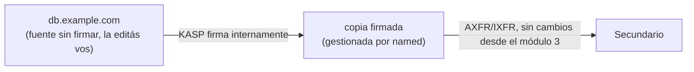

# 04 - Firmando una zona con BIND y KASP

Con el primario y el secundario de `example.com` del [módulo 3](03-Zonas-BIND.md) ya funcionando —pero sirviendo la zona en texto plano—, toca firmarla. Este módulo convierte ese mismo primario en un **inline-signer**: sigue siendo el mismo servidor, pero a partir de acá `named` gestiona las claves y produce automáticamente la versión firmada de la zona. El secundario no necesita ningún cambio — sigue transfiriendo por AXFR/IXFR exactamente como en el módulo 3, solo que ahora lo que transfiere ya viene firmado.

## Repaso: KSK vs ZSK, y por qué el rollover

En el [módulo 2](02-Registros.md) vimos, con `isc.org`, que hay dos DNSKEY con roles distintos: la KSK firma únicamente el DNSKEY RRset, la ZSK firma todo lo demás. La razón de separar los roles:

- El **DS** en el padre apunta al hash de la **KSK**, no de la ZSK. Rotar la ZSK es un asunto puramente interno de la zona — no requiere tocar nada en el padre. Rotar la KSK sí implica actualizar el DS en el padre, un paso manual fuera del control de la zona misma.
- Por eso, en la práctica, la ZSK rota con más frecuencia (menor costo operativo por rotación) y la KSK se mantiene más tiempo estable (cada rotación cuesta una coordinación externa).

El **rollover** en sí —reemplazar una clave por otra sin romper la validación mientras el cambio se propaga— es lo que motiva la automatización que viene a continuación. La mecánica completa (estados de una clave, períodos de doble firma, cómo se ve un rollover en curso) se cubre en detalle en el módulo 7; acá alcanza con entender que existe y por qué.

## Qué es KASP

KASP (Key and Signing Policy) es el mecanismo con el que BIND automatiza todo el ciclo de vida de las claves y la firma: generación, publicación, uso, rotación y retiro — sin que haga falta correr `dnssec-keygen` y `dnssec-signzone` a mano cada vez, que era el flujo de trabajo antes de que KASP se integrara al propio `named` (BIND ≥ 9.16). Una `dnssec-policy` es, en esencia, un perfil reutilizable: algoritmo, tiempos de vida de cada clave, y varios parámetros de la firma, todo declarado una vez y aplicado a una o más zonas.

## Migrar el primario a firmado inline

Hasta el módulo 3, `/etc/bind/db.example.com` era el archivo que editás a mano y que `named` cargaba tal cual. Con **inline-signing**, ese archivo pasa a ser la **fuente sin firmar**: la seguís editando vos (agregar un registro, cambiar una IP), pero `named` ya no la sirve directamente. En su lugar, mantiene una copia interna firmada — separada, gestionada por él — y es esa copia la que efectivamente se responde en las consultas y se transfiere al secundario.



Esta separación entre "fuente sin firmar" y "copia firmada" —hoy interna, dentro del mismo proceso `named`— es exactamente el concepto que el [módulo 6](06-Arquitectura-Hidden-Signer.md) lleva un paso más allá, separándolas en dos servidores físicos distintos.

Antes de activar la política hace falta un directorio para las claves, con permisos correctos para el usuario `bind` (mismo tipo de detalle de permisos que vimos con AppArmor en el módulo 3 — si usás una ruta fuera de `/etc/bind` o `/var/cache/bind`, hay que actualizar el perfil):

```
$ sudo mkdir -p /etc/bind/keys/example.com
$ sudo chown bind:bind /etc/bind/keys/example.com
```

## Configurando una dnssec-policy

En `named.conf.options` (o un archivo separado incluido desde ahí), se declara la política:

```
dnssec-policy "operadores" {
    keys {
        ksk lifetime unlimited algorithm ecdsap256sha256;
        zsk lifetime P90D algorithm ecdsap256sha256;
    };

    dnskey-ttl PT1H;
    publish-safety PT1H;
    retire-safety PT1H;
    signatures-refresh P5D;
    signatures-validity P2W;
    signatures-validity-dnskey P2W;
    max-zone-ttl P1D;
    purge-keys P90D;
};
```

Algunas notas sobre esta política de ejemplo:

- **Algoritmo `ecdsap256sha256`** — el mismo algoritmo 13 que vimos en los RRSIG de `isc.org` en el módulo 2. Vas a ver el mismo número en el `dig` más abajo.
- **`ksk lifetime unlimited`** — no rota automáticamente; el rollover de KSK, cuando se necesite, se dispara a mano (tiene sentido: cada rollover de KSK implica coordinar el DS en el padre, no es algo para dejar en piloto automático).
- **`zsk lifetime P90D`** — rota cada 90 días sin intervención (formato de duración tipo ISO 8601: `P90D` = 90 días, `PT1H` = 1 hora).
- **Sin `nsec3param`** — al no declararlo, la política usa **NSEC**, lo mismo que vimos en el módulo 2. NSEC3 es una opción explícita (`nsec3param ...`) que se cubre en el módulo 7.

Y en la zona, dentro de `named.conf.local`:

```
zone "example.com" {
    type primary;
    file "/etc/bind/db.example.com";
    key-directory "/etc/bind/keys/example.com";
    dnssec-policy "operadores";
    inline-signing yes;

    allow-transfer { key transfer-key; };
    also-notify { 192.0.2.2; };
    notify yes;
};
```

Todo lo demás (`allow-transfer`, `also-notify`, la ACL/TSIG) es exactamente lo que configuramos en el módulo 3 — no cambia nada del lado de la transferencia de zona.

## Firmado automático de zona

Validar y recargar como siempre:

```
$ named-checkconf
$ sudo rndc reload example.com
zone example.com/IN: reloaded
```

En el log, `named` va a mostrar que generó las claves y empezó a firmar:

```
$ journalctl -u named --since "1 min ago"
... zone example.com/IN: reconfiguring zone keys
... zone example.com/IN: DNSKEY (Kexample.com.+013+41230) is now published
... zone example.com/IN: DNSKEY (Kexample.com.+013+54915) is now published
... zone example.com/IN: signing zone: done
```

Las claves quedan en el directorio que declaramos:

```
$ ls /etc/bind/keys/example.com/
Kexample.com.+013+41230.key   Kexample.com.+013+41230.private   (ZSK, key id 41230)
Kexample.com.+013+54915.key   Kexample.com.+013+54915.private   (KSK, key id 54915)
```

`+013+` en el nombre del archivo es justamente el algoritmo (13 = ECDSAP256SHA256) — el mismo número que veníamos rastreando desde el módulo 2. Los key id (41230, 54915) son arbitrarios, generados al crear cada clave — no se eligen a mano.

Para ver el estado de la firma en cualquier momento sin ir al log:

```
$ rndc signing -list example.com
Signing with key 013+41230
Signing with key 013+54915
```

## Verificación de la firma

Con `dig`, ahora `example.com` responde con RRSIG y DNSKEY, igual que vimos con `isc.org` en el módulo 2 — y con el mismo patrón: la KSK (54915) firma el DNSKEY RRset, la ZSK (41230) firma todo lo demás:

```
$ dig @127.0.0.1 example.com DNSKEY +dnssec +multiline
example.com. 3600 IN DNSKEY 256 3 13 ( ...base64... ) ; ZSK; key id = 41230
example.com. 3600 IN DNSKEY 257 3 13 ( ...base64... ) ; KSK; key id = 54915
example.com. 3600 IN RRSIG DNSKEY 13 2 3600 ( ...20260805... 54915 example.com. ... )

$ dig @127.0.0.1 example.com A +dnssec +short
93.184.216.34
A 13 2 3600 20260819 20260805 41230 example.com. ...
```

`delv` valida la cadena de confianza de punta a punta, no solo que la firma exista:

```
$ delv @127.0.0.1 example.com A
;; validating example.com/A: no valid signature found... 
;; resolution failed: insecure
93.184.216.34
```

Ese `insecure` es **esperado en este punto** — no es un error. `delv` (y cualquier validador real) no tiene forma de confiar en la KSK de `example.com` todavía, porque el DS que la certificaría no está publicado en el padre. La zona está firmada y es internamente consistente, pero la cadena de confianza del módulo 1 todavía tiene un eslabón roto — falta el próximo paso.

`dnssec-verify` chequea la señal completa sin depender del padre — sirve para confirmar que la firma es correcta antes de publicar nada:

```
$ dnssec-verify -o example.com /var/cache/bind/example.com.signed
Loading zone 'example.com' from file '/var/cache/bind/example.com.signed'
Verifying the zone using the following algorithms: ECDSAP256SHA256.
Zone fully signed:
Algorithm: ECDSAP256SHA256: KSKs: 1 active, 0 stand-by, 0 revoked
                            ZSKs: 1 active, 0 stand-by, 0 revoked
```

(El nombre exacto del archivo firmado en disco puede variar según la instalación; `rndc zonestatus example.com` muestra la ruta configurada si no es la esperada.)

## Publicación del DS en el padre

El DS es un hash de la KSK — se genera a partir del archivo de clave pública de la KSK, no de la zona firmada:

```
$ dnssec-dsfromkey /etc/bind/keys/example.com/Kexample.com.+013+54915.key
example.com. IN DS 54915 13 2 A94C3B1F... (SHA-256)
```

Ese registro (key tag, algoritmo, tipo de digest, hash) es lo que se sube al **padre** — el registrador o el operador del TLD, en el mismo lugar donde se gestionan los NS y el glue vistos en el módulo 3. El flujo:

1. Confirmar que la zona ya está sirviendo RRSIG/DNSKEY válidos (paso anterior) — **nunca publicar el DS antes de esto**. Si el DS está en el padre pero la zona no firma correctamente, cualquier resolver validador empieza a rechazar toda la zona.
2. Cargar el DS en el panel del registrador/TLD.
3. Esperar propagación (TTL del DS en el padre + caché de resolvers, igual que con los NS en el módulo 3).
4. Volver a correr `delv` — con el DS ya propagado, el resultado debería pasar de `insecure` a validado:

```
$ delv @127.0.0.1 example.com A
; fully validated
93.184.216.34
```

Con esto, la cadena de confianza del módulo 1 (raíz → TLD → `example.com`) queda completa.

## Rollovers: panorama general

KASP ya está rotando la ZSK cada 90 días según la política, sin que haga falta ningún paso manual — el rollover completo (publicar la clave nueva, empezar a firmar con ella, retirar la vieja) ocurre solo, con superposición suficiente para que no haya ventana donde una firma sea inválida.

La KSK es distinta: como su rollover implica actualizar el DS en el padre, y KASP no tiene acceso al panel del registrador, ese paso siempre requiere intervención humana — es la única parte del ciclo que no se puede dejar en automático. Si se rota la KSK sin actualizar el DS a tiempo, la validación se rompe para toda la zona.

Los estados internos de una clave durante un rollover, los tiempos de seguridad entre cada estado, y cómo observar un rollover en curso con `dnssec-settime`/`rndc dnssec -status`, se ven en detalle en el [módulo 7](07-DNSSEC-Avanzado.md).

## Resumen

| Concepto | Qué logra |
| --- | --- |
| `dnssec-policy` | Perfil reutilizable: algoritmo, tiempos de vida de KSK/ZSK, parámetros de firma |
| `inline-signing yes` | El archivo de zona pasa a ser fuente sin firmar; `named` mantiene la copia firmada por separado |
| `dnssec-dsfromkey` | Genera el registro DS a partir de la KSK, para publicar en el padre |
| DS en el padre | Cierra la cadena de confianza — sin esto, la zona firma pero nadie la valida |
| Rollover de ZSK vs KSK | El de ZSK es automático e interno; el de KSK requiere actualizar el DS a mano |

- El mismo primario del módulo 3 ahora firma la zona; el secundario sigue funcionando sin cambios.
- Firmar la zona no alcanza por sí solo — sin el DS publicado en el padre, un validador real la sigue viendo como `insecure`.
- Siguiente: [05-Monitoreo-Troubleshooting.md](05-Monitoreo-Troubleshooting.md) — qué vigilar en una zona firmada y cómo diagnosticar cuando algo falla.
