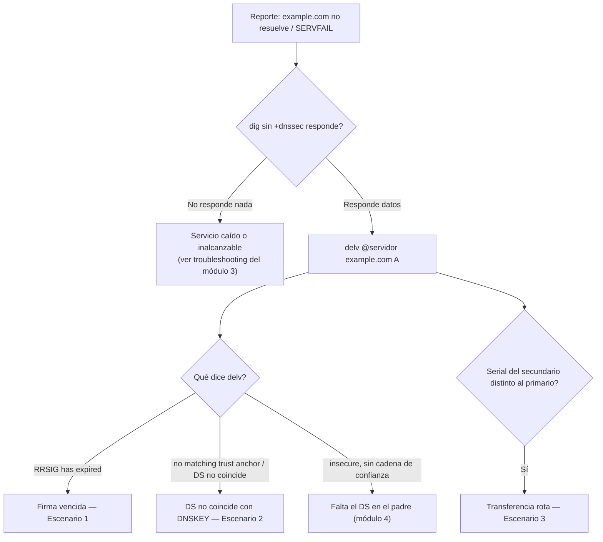

# 05 - Monitoreo y troubleshooting

Con `example.com` firmada y funcionando desde el [módulo 4](04-Firmando-con-BIND-y-KASP.md), toca la pregunta operativa: ¿qué hay que vigilar para que siga funcionando, y qué hacer cuando algo se rompe? La mayoría de los incidentes de DNSSEC en producción no son ataques — son firmas que vencieron sin que nadie se diera cuenta, un DS mal copiado al registrador, o un secundario que quedó desincronizado en silencio. Este módulo cubre los tres, reproduciéndolos deliberadamente sobre el mismo `example.com` de los módulos 3 y 4, más una tabla de referencia para el resto de los síntomas comunes.

## Qué monitorear, y cada cuánto

| Parámetro | Cómo chequearlo | Frecuencia sugerida |
| --- | --- | --- |
| Tiempo restante antes de que venza el RRSIG más próximo | `dig +dnssec` sobre el RRset, o un script (más abajo) | Diario |
| DS del padre vs. DNSKEY vigente de la zona | `dig DS` al padre + `dnssec-dsfromkey` sobre la KSK activa | Tras cualquier rollover de KSK; rutina semanal igual |
| Serial del primario vs. cada secundario | `dig SOA` a cada servidor | Cada pocos minutos, o alertar directamente sobre fallos de NOTIFY/transferencia en el log |
| NS y glue del padre vs. la propia zona | `dig NS` al padre + `dig NS` a la zona | Tras cualquier cambio de NS; rutina mensual |
| Si hay un rollover en curso | `rndc signing -list` (mecánica completa en el módulo 7) | Según el calendario de la `dnssec-policy` |

## Árbol de diagnóstico rápido

Ante un reporte de "esto no resuelve" o `SERVFAIL`, el orden que ahorra más tiempo:



## Herramientas

Lo que ya venimos usando desde los módulos 3 y 4 sigue siendo la base:

| Herramienta | Para qué |
| --- | --- |
| `dig +dnssec` | Ver RRSIG/DNSKEY tal cual los recibe un cliente |
| `delv` | Validar la cadena de confianza completa, igual que un resolver validador |
| `rndc zonestatus` / `rndc signing -list` | Estado de firmado de una zona sin ir al log |
| `named-checkzone` / `dnssec-verify` | Validar sintaxis y firma antes de confiar en que algo "debería andar" |

**Un script simple de alerta**, para no depender de acordarse de correr `dig` a mano:

```bash
#!/bin/bash
# chequea-rrsig.sh — alerta si una firma vence en menos de N días
ZONA="example.com"
UMBRAL_DIAS=3

VENCE=$(dig +dnssec @127.0.0.1 "$ZONA" A | awk '/^example.com.*RRSIG/ {print $9; exit}')
VENCE_EPOCH=$(date -d "${VENCE:0:8} ${VENCE:8:2}:${VENCE:10:2}:${VENCE:12:2}" +%s)
AHORA_EPOCH=$(date +%s)
DIAS_RESTANTES=$(( (VENCE_EPOCH - AHORA_EPOCH) / 86400 ))

if [ "$DIAS_RESTANTES" -lt "$UMBRAL_DIAS" ]; then
    echo "ALERTA: RRSIG de $ZONA vence en $DIAS_RESTANTES día(s)" | logger -t dnssec-check
fi
```

Corrido por `cron` una vez al día, esto cubre el escenario más común de todos: nadie se entera de que la firma automática dejó de renovarse hasta que un resolver empieza a rechazar la zona.

**Herramientas externas** (fuera del CLI local, útiles sobre todo contra un dominio realmente delegado):

- **DNSViz** (`dnsviz.net`, o el paquete `dnsviz` por línea de comandos) — grafica la cadena de confianza completa de una zona, marcando en rojo exactamente qué eslabón falla. Es probablemente la herramienta más rápida para entender un problema de validación que no es obvio con `delv`.
- **Zonemaster** (`zonemaster.net`) — batería de chequeos más amplia, no solo DNSSEC: delegación, glue, consistencia entre servidores, etc. Bueno como chequeo periódico de salud general de una zona delegada.
- **Monitoreo continuo** — `named` expone estadísticas por `statistics-channels` (JSON/XML) que un exporter de Prometheus (`bind_exporter`) puede scrapear; Zabbix tiene templates de comunidad para alertar sobre vencimiento de firmas. No entramos en la configuración de ninguno de los dos acá — alcanza con saber que existen si el script de cron se queda corto para una operación con muchas zonas.

## El hueco entre el lab y un dominio real

`example.com` no tiene un DS real publicado en ningún padre — no está delegado en el internet real, así que `delv` local es lo más cerca que podemos llegar a "validar como lo haría un resolver". Contra un dominio de verdad, conviene además chequear con algo que vea la zona desde afuera: DNSViz (arriba) o directamente un resolver público con `+cd` (*checking disabled*, para comparar la respuesta con y sin validación):

```
$ dig @1.1.1.1 example.com A          # como lo ve un resolver validador
$ dig @1.1.1.1 example.com A +cd      # con la validación desactivada, para comparar
```

Si la primera falla (o devuelve `SERVFAIL`) y la segunda funciona, el problema es específicamente de DNSSEC — no de DNS en general. Es el mismo patrón que vamos a reproducir localmente con `delv` en los tres escenarios siguientes.

## Escenario 1: firma vencida

La causa más común en la práctica: `named` estuvo caído (mantenimiento largo, falla de hardware, lo que sea) más tiempo del que dura la validez de las firmas. Una firma tiene fecha de vencimiento absoluta — no le importa si el servidor estuvo vivo o no mientras tanto.

Para reproducir esto en minutos en vez de semanas, achicamos temporalmente la política **solo para este ejercicio**:

```
dnssec-policy "operadores" {
    keys {
        ksk lifetime unlimited algorithm ecdsap256sha256;
        zsk lifetime P90D algorithm ecdsap256sha256;
    };
    signatures-validity PT10M;   // 10 minutos — normalmente P2W, ver módulo 4
    signatures-refresh PT5M;     // normalmente P5D
    dnskey-ttl PT1H;
    ...
};
```

```
$ sudo rndc reconfig
$ dig @127.0.0.1 example.com A +dnssec +short | tail -1
A 13 2 3600 20260805143000 20260805132000 41230 example.com. ...
```

(El primer timestamp es el vencimiento — ahora a solo 10 minutos.) Simulamos la caída:

```
$ sudo systemctl stop bind9
$ sleep 720   # 12 minutos — más que la validez de 10
$ sudo systemctl start bind9
```

`named` vuelve a levantar sirviendo la última zona firmada que tenía en disco — con la firma ya vencida, hasta que su ciclo de mantenimiento la detecte y renueve:

```
$ dig @127.0.0.1 example.com A +dnssec +short | tail -1
A 13 2 3600 20260805143000 20260805132000 41230 example.com. ...   # sigue siendo la vieja, vencida

$ delv @127.0.0.1 example.com A
;; validating example.com/A: verify failed due to bad signature (keyid=41230): RRSIG has expired
;; validating example.com/A: no valid signature found
;; broken trust chain resolving 'example.com/A/IN'
;; resolution failed: SERVFAIL
```

Este `SERVFAIL` es distinto del `insecure` que vimos en el módulo 4: acá el DS sí existe y la cadena de confianza está armada — lo que falla es la firma en sí. Un validador real trata esto como **bogus**, no como zona sin firmar, y por eso corta en seco con `SERVFAIL` en vez de simplemente ignorar DNSSEC.

`named` se recupera solo apenas nota que el RRSIG venció (el ciclo de mantenimiento de KASP corre también al cargar la zona):

```
$ journalctl -u named --since "1 min ago"
... zone example.com/IN: reconfiguring zone keys
... zone example.com/IN: some RRSIGs have expired; signing zone
... zone example.com/IN: signing zone: done

$ delv @127.0.0.1 example.com A
; fully validated
93.184.216.34
```

**No olvidar revertir la política** a los valores reales del módulo 4 (`signatures-validity P2W`, `signatures-refresh P5D`) antes de seguir — quedarse con una validez de 10 minutos en cualquier entorno que no sea este ejercicio puntual es buscarse este mismo incidente todas las semanas.

## Escenario 2: DS que no coincide con la DNSKEY (simulado)

Esto reproduce, sin tocar ninguna clave real, el error más común al publicar el DS: copiar mal un carácter al pegarlo en el panel del registrador. El síntoma es idéntico al de un rollover de KSK donde el DS no se actualizó a tiempo (eso se opera en detalle en el módulo 7) — la causa cambia, el diagnóstico es el mismo.

`delv` permite validar contra un ancla de confianza declarada a mano con `-a`, sin depender de un padre real — perfecto para este ejercicio, ya que `example.com` no tiene uno.

Con el DS correcto del módulo 4:

```
$ cat > /tmp/ta-correcto.conf <<EOF
trust-anchors {
    example.com. static-ds 54915 13 2 "A94C3B1F...";
};
EOF

$ delv -a /tmp/ta-correcto.conf @127.0.0.1 example.com A
; fully validated
93.184.216.34
```

Ahora, el mismo archivo pero con el dígito final del hash alterado — simulando el typo al pegarlo en el registrador:

```
$ cat > /tmp/ta-incorrecto.conf <<EOF
trust-anchors {
    example.com. static-ds 54915 13 2 "A94C3B0F...";
};
EOF

$ delv -a /tmp/ta-incorrecto.conf @127.0.0.1 example.com A
;; verify failed: DS does not match DNSKEY
;; no valid trust anchor found
;; resolution failed: SERVFAIL
```

Lo inquietante de este fallo: `dnssec-verify` sobre la zona (módulo 4) sigue diciendo que todo está perfectamente firmado — porque lo está. El problema no está en la zona, está en lo que el padre publica. Es exactamente por eso que conviene, después de cargar el DS en el registrador, volver a chequear con algo que mire desde afuera (DNSViz, o `dig @resolver-publico` como en la sección anterior) en vez de confiar en que "la zona firma bien" es suficiente.

## Escenario 3: secundario desincronizado

Rompemos la transferencia desde el primario, simulando un cambio de ACL o firewall accidental:

```
# en el primario, named.conf.local — le sacamos el acceso al secundario
zone "example.com" {
    ...
    allow-transfer { key transfer-key; };   // dejamos esto, pero...
};
```

```
$ sudo iptables -A INPUT -s 192.0.2.2 -p tcp --dport 53 -j DROP   # simula el firewall/ACL roto
```

Hacemos un cambio cualquiera en la zona (sube el serial) y recargamos:

```
$ sudo rndc reload example.com
```

En el secundario, la transferencia falla en silencio — sigue respondiendo consultas con su última copia buena, sin avisar por sí solo que quedó atrás:

```
$ dig @192.0.2.1 example.com SOA +short   # primario
ns1.example.com. admin.example.com. 2026080502 ...

$ dig @192.0.2.2 example.com SOA +short   # secundario — serial viejo
ns1.example.com. admin.example.com. 2026080401 ...

$ sudo rndc retransfer example.com   # corrido en el secundario
$ journalctl -u named --since "1 min ago"
... transfer of 'example.com/IN' from 192.0.2.1#53: failed to connect: timed out
```

Diagnóstico: mismo orden que en el módulo 3 (ACL/TSIG del lado del primario, conectividad, logs de ambos lados). La combinación peligrosa con el escenario 1: un secundario desincronizado que sigue sirviendo RRSIGs cada vez más viejos, sin que nadie lo note hasta que esas firmas también vencen — dos fallas independientes que se potencian.

Arreglo y verificación:

```
$ sudo iptables -D INPUT -s 192.0.2.2 -p tcp --dport 53 -j DROP
$ sudo rndc retransfer example.com   # en el secundario
$ dig @192.0.2.2 example.com SOA +short
ns1.example.com. admin.example.com. 2026080502 ...   # ya sincronizado
```

## Tabla de referencia: otros síntomas comunes

| Síntoma | Causa probable | Cómo confirmarlo | Solución |
| --- | --- | --- | --- |
| Delegación "lame" — algunos resolvers fallan, otros no | NS del padre no coincide con el de la zona | `dig NS` al padre vs. a la zona (módulo 3) | Corregir NS/glue en el registrador |
| Validación falla solo para algunos resolvers, no todos | TTL viejo del DS/DNSKEY todavía en caché en tránsito tras una corrección reciente | Repetir la consulta desde varios resolvers, comparar | Esperar el TTL — no es un problema nuevo, es propagación |
| Zona no vuelve a firmar tras un cambio manual al archivo fuente | Se perdió la asociación `dnssec-policy`/`inline-signing` en la zona | `named-checkconf`, `rndc zonestatus example.com` | Revisar que la zona siga referenciando la política (módulo 4) |
| `rndc` deja de responder justo después de un cambio de hora del sistema | Reloj desincronizado — mismo problema que ya vimos con `rndc` en el módulo 3, pero también rompe la validación de firmas | `timedatectl` | Sincronizar con NTP; revisar si además hay RRSIGs afectados |
| Un algoritmo de firma nuevo no valida en algunos resolvers | El resolver es viejo y no soporta ese algoritmo todavía | `dig +dnssec` desde ese resolver puntual | Evaluar si conviene esperar antes de migrar de algoritmo en producción |

## Resumen

- La mayoría de los incidentes de DNSSEC son operativos, no ataques: firmas que no se renovaron, un DS mal publicado, un secundario que se quedó atrás en silencio.
- `delv` distingue tres resultados que no son lo mismo: `insecure` (no hay DS, módulo 4), `SERVFAIL`/bogus por firma vencida (escenario 1), y `SERVFAIL`/bogus por DS que no coincide con la DNSKEY (escenario 2) — el mensaje exacto de `delv` dice cuál es cuál.
- Una zona puede firmar perfectamente (`dnssec-verify` conforme) y aun así fallar la validación para todo el mundo, si el problema está en lo que el padre publica.
- Un secundario desincronizado no avisa solo — hay que vigilar el serial activamente, no asumir que "si responde, está al día".
- Siguiente: [06-Arquitectura-Hidden-Signer.md](06-Arquitectura-Hidden-Signer.md) — separar el firmado de la publicación en servidores distintos.
