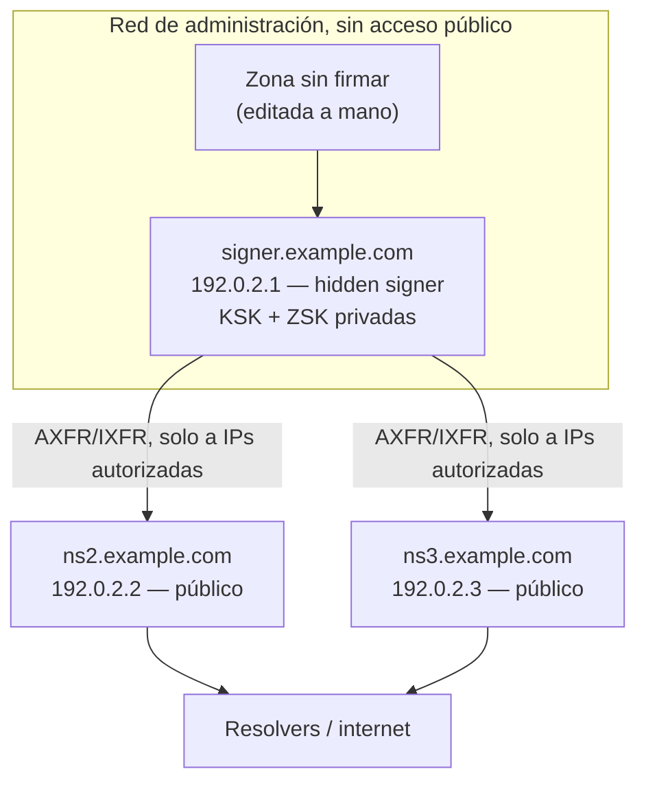

# 06 - Arquitectura con hidden signer

En el [módulo 4](04-Firmando-con-BIND-y-KASP.md) señalamos algo que quedó pendiente: dentro del mismo proceso `named`, inline-signing ya separa la **fuente sin firmar** de la **copia firmada** — son dos cosas distintas, solo que conviven en el mismo servidor. Este módulo lleva esa misma separación un paso más allá: a dos servidores físicos distintos, donde el que firma **nunca** es alcanzable directamente desde internet.

## Motivación: separar la firma de la publicación

Hasta acá, `192.0.2.1` (el primario del módulo 3, firmando desde el módulo 4) hace dos trabajos a la vez: sostiene las claves privadas y firma la zona, **y** está públicamente delegado como `ns1.example.com`, respondiendo consultas de cualquiera en internet. Eso significa que cualquier vulnerabilidad en el servicio DNS público — un bug de `named`, una consulta malformada, un ataque de denegación de servicio — pone en juego, en el peor caso, al mismo proceso que tiene las claves privadas cargadas en memoria.

Un **hidden signer** (o *hidden master*) rompe esa combinación: el servidor que firma no publica nada directamente. Solo un puñado de servidores públicos, de confianza explícita, lo consultan por transferencia de zona — y son esos servidores públicos, sin ninguna clave privada, los que efectivamente responden a internet.

## Ventajas

- **Superficie de ataque reducida**: el signer no acepta consultas DNS comunes de nadie. No hay superficie pública para bugs de parseo, amplificación, ni reconocimiento — el único protocolo que expone es la transferencia de zona, y solo hacia IPs específicas y autenticadas.
- **Aislamiento de claves privadas**: comprometer un servidor público (`ns2`, `ns3`) no expone ninguna clave — esas máquinas nunca tuvieron una KSK ni una ZSK, solo la zona ya firmada.
- **Disponibilidad**: los servidores públicos pueden multiplicarse y distribuirse geográficamente sin multiplicar el riesgo de exposición de claves. Si el signer queda temporalmente inalcanzable, los públicos siguen respondiendo con la última zona firmada que tienen — hasta que las firmas se acerquen a vencer (el mismo escenario que reprodujimos en el módulo 5).

## Componentes y flujo



Notá que el signer no tiene ninguna flecha hacia "Resolvers / internet" — esa es exactamente la propiedad que estamos construyendo.

## Migrar `example.com` a esta arquitectura

`192.0.2.1` deja de llamarse `ns1.example.com` — ese nombre implica "nameserver público", y ya no lo es. Pasa a ser `signer.example.com`, y sale por completo del NS RRset de la zona. `192.0.2.2` (el `ns2` del módulo 3) sigue exactamente igual — ya era un secundario del `192.0.2.1`, y eso no cambia; solo cambia qué es `192.0.2.1` de cara al mundo. Agregamos un tercer servidor, `192.0.2.3` como `ns3.example.com`, para no quedar con un único punto público (la misma razón del módulo 3 para tener más de un servidor autoritativo).

### 1. Archivo de zona: sale `ns1`, entra `ns3`, y el SOA apunta al signer

```zone
$TTL 3600
example.com.        IN  SOA   signer.example.com. admin.example.com. (
                                     2026080601 ; serial
                                     3600       ; refresh
                                     600        ; retry
                                     1209600    ; expire
                                     3600 )     ; minimum
example.com.        IN  NS    ns2.example.com.
example.com.        IN  NS    ns3.example.com.
ns2.example.com.    IN  A     192.0.2.2
ns3.example.com.    IN  A     192.0.2.3
example.com.        IN  A     93.184.216.34
www.example.com.    IN  CNAME example.com.
```

Dos cambios respecto al módulo 3, y los dos son intencionales:

- **El MNAME del SOA (`signer.example.com`) no aparece en el NS RRset.** No es un error — el MNAME identifica al servidor donde se originan los cambios de la zona, no tiene por qué ser público, y en una arquitectura hidden-signer casi nunca lo es. Vale la pena dejarlo explícito en la documentación del equipo, porque a primera vista parece una inconsistencia.
- **`ns1.example.com` desaparece.** No se apunta a otra IP, no queda como alias — se borra. Dejar un NS "fantasma" apuntando a un host que ya no responde consultas públicas es peor que no tenerlo: un resolver que todavía lo recuerde va a intentar consultarlo y fallar antes de probar con `ns2`/`ns3`.

### 2. El signer: firma, pero no atiende consultas públicas

`named.conf.local` en `192.0.2.1`, sobre la base del módulo 4:

```
zone "example.com" {
    type primary;
    file "/etc/bind/db.example.com";
    key-directory "/etc/bind/keys/example.com";
    dnssec-policy "operadores";
    inline-signing yes;

    allow-transfer { key transfer-key; };
    also-notify { 192.0.2.2; 192.0.2.3; };
    notify yes;
};
```

Nuevo respecto al módulo 3/4 — `also-notify` ahora tiene dos destinos en vez de uno, y en `named.conf.options`:

```
options {
    recursion no;
    allow-recursion { none; };
    allow-query { none; };
    ...
};
```

`allow-query { none; }` es la pieza que realmente hace a este servidor "hidden": en el módulo 3 controlamos quién puede *transferir* la zona completa (`allow-transfer`), pero el servidor seguía respondiendo consultas normales (`dig A`) a cualquiera. Acá se lo negamos incluso eso — el signer no le contesta una consulta DNS común a nadie, ni siquiera por su propia zona. Su única función de red es firmar y transferir a `ns2`/`ns3`.

### 3. Los servidores públicos: `ns2` sin cambios, `ns3` nuevo

`ns2` (`192.0.2.2`) no necesita ningún cambio de configuración — ya era secundario de `192.0.2.1`, y sigue siéndolo; lo único que cambió es qué es `192.0.2.1` puertas afuera. `ns3` se levanta con la misma receta del módulo 3:

```
zone "example.com" {
    type secondary;
    primaries { 192.0.2.1 key transfer-key; };
    file "/var/cache/bind/example.com.secondary";
};
```

Un endurecimiento nuevo acá, del lado de los públicos: restringir de quién aceptan un NOTIFY, para que nadie pueda gatillarles una retransferencia con un NOTIFY falsificado:

```
options {
    allow-notify { 192.0.2.1; };
};
```

### 4. Actualizar NS y glue en el padre

Mismo procedimiento del módulo 3, ahora con contenido real que cambia: quitar el glue de `ns1` (`192.0.2.1`), agregar el de `ns3` (`192.0.2.3`), mantener el de `ns2`. El orden importa para no dejar una ventana de delegación rota:

1. Agregar `ns3` (glue + NS) al padre **antes** de sacar `ns1` — durante la transición, el padre delega a los tres.
2. Confirmar que `ns2` y `ns3` ya están sirviendo la zona firmada correctamente (`dig`/`delv` contra ambos).
3. Recién ahí, quitar `ns1` del padre.
4. Esperar el TTL del NS/glue viejo antes de dar la migración por terminada — algunos resolvers van a seguir intentando `ns1` hasta que ese TTL expire.

Saltear el paso 1 (sacar `ns1` antes de tener `ns3` funcionando) deja a la zona con un único servidor público durante la transición — exactamente el escenario de punto único de falla que el módulo 3 buscaba evitar.

### 5. Verificar

```
$ dig @192.0.2.2 example.com A +dnssec +short    # ns2, responde firmado
$ dig @192.0.2.3 example.com A +dnssec +short    # ns3, responde firmado
$ dig @192.0.2.1 example.com A +short             # el signer — sin respuesta
;; connection timed out; no servers could be reached
```

Ese último timeout **es el resultado esperado** — si `192.0.2.1` contesta esa consulta, `allow-query { none; }` no está funcionando como debería.

## Buenas prácticas

**Control de acceso**, más allá de lo ya configurado arriba: el firewall (o el security group, según dónde viva esto) debería negar por completo el tráfico entrante al signer salvo desde las IPs de `ns2` y `ns3` — `allow-query`/`allow-transfer` en `named.conf` son la segunda capa, no la única. Si alguien puede llegar por red al puerto 53 del signer aunque `named` se niegue a responder, sigue habiendo superficie (el propio proceso `named` recibiendo paquetes). El acceso administrativo (SSH, `rndc` remoto si aplica) merece el mismo tratamiento: red de gestión separada, no la misma que usan los clientes DNS.

**Monitoreo**: nada nuevo que agregar acá — todo lo del módulo 5 (vencimiento de firmas, sincronía de seriales, DS vs. DNSKEY) aplica igual, salvo que ahora hay que vigilarlo contra `ns2`/`ns3`, no contra el signer, porque el signer es precisamente el servidor al que no se le hacen consultas normales.

**Backups de claves**:

- Lo que hay que respaldar no es solo `Kexample.com.+013+*.key`/`.private` — KASP también mantiene archivos de estado (metadata de cada clave: cuándo se publicó, cuándo entra en uso, próximos eventos) en el mismo directorio. Un backup que solo copia las claves y no ese estado puede reconstruir la criptografía pero pierde el historial que KASP usa para decidir el próximo paso de un rollover.
- Cifrado en reposo (el `key-directory` completo, no archivo por archivo) y al menos una copia fuera del propio signer — si el disco del signer se pierde sin backup, se pierde la zona firmable, no solo el servicio.
- La severidad de perder una clave no es la misma para las dos: perder la ZSK sin backup es molesto pero recuperable — KASP genera una nueva y rota, sin depender de nadie más. Perder la **KSK** sin backup es mucho peor: como el DS en el padre certifica esa KSK específica, no hay forma de "generar una nueva" sin repetir el procedimiento completo de publicación del DS del módulo 4 — con la zona efectivamente insegura mientras tanto.
- Probar la restauración, no solo hacerla. Un backup que nunca se restauró es una suposición, no una garantía.

## Resumen

| Concepto | Qué logra |
| --- | --- |
| `allow-query { none; }` en el signer | El signer no responde consultas DNS comunes — su única función de red es firmar y transferir |
| `also-notify` a ambos públicos | El signer avisa a los dos servidores públicos, no solo a uno |
| `allow-notify` en los públicos | Evita que un NOTIFY falsificado dispare una retransferencia no autorizada |
| MNAME del SOA ≠ un NS público | Normal en hidden-signer — el MNAME identifica el origen de los cambios, no implica reachability pública |
| Backup del `key-directory` completo | Incluye el estado de KASP, no solo las claves — necesario para no perder el historial de rollover |

- El signer nunca aparece en el NS RRset ni en el glue del padre — solo `ns2` y `ns3` lo hacen.
- La migración de un primario público a hidden signer es, en esencia, la misma disciplina de coherencia de NS/glue del módulo 3, aplicada a un cambio real: agregar el nuevo público antes de sacar el viejo.
- Siguiente: [07-DNSSEC-Avanzado.md](07-DNSSEC-Avanzado.md) — NSEC3 y la mecánica completa de rollovers gestionados por KASP.
