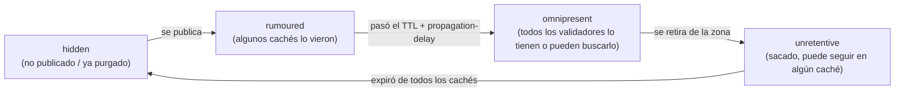

# 07 - DNSSEC avanzado

En el [módulo 4](04-Firmando-con-BIND-y-KASP.md) dejamos dos cosas pendientes a propósito: la mecánica interna de un rollover, y NSEC3. Este módulo cierra ambas, y de paso agrega tres temas que hasta ahora no aparecieron: algorithm rollover, CDS/CDNSKEY, y multi-signer. Seguimos operando sobre `example.com`, con la misma `dnssec-policy "operadores"` del módulo 4, corriendo en el hidden signer (`192.0.2.1`) del [módulo 6](06-Arquitectura-Hidden-Signer.md).

## NSEC3 en profundidad

En el [módulo 2](02-Registros.md) quedó dicho sin profundizar: NSEC3 existe para evitar *zone walking* — que alguien recorra los NSEC de una zona, uno detrás del otro, y reconstruya la lista completa de nombres que existen. NSEC3 resuelve el mismo problema que NSEC (probar que un nombre *no* existe), pero en vez de encadenar nombres en texto plano, encadena sus **hashes**.

### nsec3param: iterations, salt, opt-out

Dentro de una `dnssec-policy`, NSEC3 se activa declarando `nsec3param`:

```
nsec3param iterations 0 optout no salt-length 0;
```

- **`iterations`** — cuántas veces se aplica el hash antes de guardarlo. Parece intuitivo pensar "más iteraciones, más seguro", pero [RFC 9276](https://www.rfc-editor.org/rfc/rfc9276.html) (BCP 236) cambió esa recomendación: iteraciones extra aumentan el costo de CPU para firmar *y* para validar, con beneficio de seguridad marginal — y ese costo extra es aprovechable para un ataque de agotamiento de CPU contra validadores. La recomendación actual es `iterations 0`. BIND, además, rechaza directamente valores mayores a 150.
- **`salt-length`** — un valor al azar mezclado en el hash para invalidar tablas precalculadas (rainbow tables). El mismo RFC 9276 recomienda **no usar salt** (`salt-length 0`) — la práctica mostró que no aporta protección real contra un atacante que ya puede consultar la zona directamente, y sí agrega complejidad operativa (cada rotación de salt cambia todos los hashes de la zona).
- **`optout`** — pensado para zonas con **muchas delegaciones sin firmar**: un registrador o un operador de subdominios que delega miles de subzonas, la mayoría todavía sin DNSSEC. Sin opt-out, cada una de esas delegaciones necesita su propio NSEC3 igual que un nombre firmado. Con `optout yes`, las delegaciones inseguras quedan afuera de la cadena NSEC3, y el tamaño/costo de firma de la zona no crece con ellas. `example.com` no tiene delegaciones propias, así que `optout no` es lo correcto acá — la opción existe para cuando sí las hay.

En la política `operadores` del módulo 4, la ausencia de `nsec3param` implicaba NSEC. Agregarlo es lo único que cambia:

```
dnssec-policy "operadores" {
    keys {
        ksk lifetime unlimited algorithm ecdsap256sha256;
        zsk lifetime P90D algorithm ecdsap256sha256;
    };

    dnskey-ttl PT1H;
    publish-safety PT1H;
    retire-safety PT1H;
    signatures-refresh P5D;
    signatures-validity P2W;
    signatures-validity-dnskey P2W;
    max-zone-ttl P1D;
    purge-keys P90D;

    nsec3param iterations 0 optout no salt-length 0;
};
```

### Verificación

```
$ named-checkconf
$ sudo rndc reload example.com
zone example.com/IN: reloaded

$ dig @192.0.2.1 example.com NSEC3PARAM +dnssec +short
1 0 0 -
```

`1 0 0 -` es: algoritmo de hash 1 (SHA-1, el único que define el estándar NSEC3), 0 flags, 0 iteraciones, y `-` como salt (vacío) — exactamente lo que pide RFC 9276.

Una consulta por un nombre que no existe ahora trae NSEC3 en vez de NSEC, con el *owner name* hasheado:

```
$ dig @192.0.2.1 nope.example.com A +dnssec

;; AUTHORITY SECTION:
b4c4z1n8h3k2m9p0q7r5s3t1u8v6w4x2.example.com. 3600 IN NSEC3 1 0 0 - ( c9d7e5f3g1h8i6j4k2l0m8n6o4p2q0r8 A RRSIG )
b4c4z1n8h3k2m9p0q7r5s3t1u8v6w4x2.example.com. 3600 IN RRSIG NSEC3 13 3 3600 ( ... )
```

Compará ese `b4c4z1n8...` con el registro `example.com. NSEC www.example.com. ...` que vimos en el módulo 2: mismo propósito (probar la no-existencia de `nope.example.com` y delimitar qué nombres sí hay), pero acá nadie puede leer directamente qué nombre real corresponde a ese hash sin fuerza bruta.

## Mecánica completa de rollovers

El módulo 4 dijo "KASP rota la ZSK cada 90 días sin intervención" y dejó ahí. Ahora sí: cómo es ese proceso por dentro.

### Dos capas, no una

Hay que distinguir dos cosas que a menudo se mezclan bajo la palabra "rollover":

1. **La línea de tiempo de una clave** — cuándo se generó, cuándo se publicó, cuándo empezó a firmar, cuándo se retiró, cuándo se borró del disco. Esto es lo que ves con `dnssec-settime`.
2. **La máquina de estados de cada *registro* que esa clave sostiene** — el DNSKEY, el DS (en el padre), y las RRSIG que esa clave produce. Cada uno de estos avanza, de forma independiente, por cuatro estados: **hidden** (no está en la zona ni en ningún caché) → **rumoured** (ya está publicado, pero no todos los cachés lo vieron todavía) → **omnipresent** (todo validador que pueda necesitarlo, ya lo tiene o puede obtenerlo) → **unretentive** (se sacó de la zona, pero puede quedar en algún caché todavía) → vuelve a **hidden**.

Es la capa 2 la que realmente determina *cuándo* KASP se anima a dar el siguiente paso — no alcanza con que pasen los días de la política, cada transición espera a que el estado anterior llegue a `omnipresent` (o `hidden`, según el caso) antes de seguir. Esto es lo que garantiza que nunca haya una ventana donde un validador confíe en algo que ya no está, o rechace algo que todavía no vio.



### ZSK: estrategia pre-publish

La ZSK (41230) sigue la que ISC llama *pre-publish*: no hay doble firma de las RRSIG de la zona en ningún momento — lo que hay es un período de **doble DNSKEY**:

1. Se genera y publica el DNSKEY de la ZSK sucesora, todavía sin firmar nada con ella. Estado del DNSKEY: `hidden` → `rumoured`.
2. Se espera a que ese DNSKEY llegue a `omnipresent` (TTL del DNSKEY + margen de `publish-safety`) — recién ahí cualquier validador que necesite esa clave puede encontrarla.
3. named empieza a firmar la zona con la ZSK nueva; la vieja deja de firmar. Las RRSIG viejas quedan en `unretentive` hasta vencer de los cachés.
4. Una vez que las RRSIG viejas y el DNSKEY viejo llegan a `hidden`, se borran del disco (`purge-keys`, 90 días en nuestra política).

Como todo esto pasa dentro de la zona misma, sin depender del padre, KASP lo hace de punta a punta sin intervención — la ZSK 41230 del módulo 4, generada el 5 de agosto, con `lifetime P90D`, va a arrancar su primer rollover automático alrededor del 3 de noviembre.

### KSK: estrategia double-KSK

La KSK (54915) es distinta, y acá sí hay **doble firma real**: durante la transición, el DNSKEY RRset queda firmado simultáneamente por la KSK vieja y la nueva.

1. Se genera y publica el DNSKEY de la KSK sucesora, y **enseguida** empieza a firmar el DNSKEY RRset junto con la KSK vieja — las dos RRSIG sobre DNSKEY conviven (esto es lo que vimos en el módulo 4 al migrar: "si ves dos KSK del mismo algoritmo, hay un rollover en curso").
2. Cuando el DNSKEY y la RRSIG nuevos llegan a `omnipresent`, se pueden publicar CDS/CDNSKEY (siguiente sección) y el operador sube el DS nuevo al padre — **doble DS**, viejo y nuevo conviviendo en el padre durante la transición.
3. Recién cuando el operador confirma (`rndc dnssec -checkds`, ver más abajo) que el DS viejo se retiró del padre, la KSK vieja pasa a `unretentive` y eventualmente `hidden`.

Este último paso — subir/retirar el DS — es la única parte de todo el ciclo que KASP no puede hacer solo, porque no tiene acceso al panel del registrador. Por eso, como ya vimos en el módulo 4, la KSK de `operadores` tiene `lifetime unlimited`: no hay rollover de KSK programado, se dispara a mano cuando haga falta.

## Inspeccionar y operar rollovers en vivo

### dnssec-settime: la línea de tiempo

```
$ dnssec-settime -p all /etc/bind/keys/example.com/Kexample.com.+013+41230.key
Created:                      Wed Aug  5 09:12:00 2026
Publish:                      Wed Aug  5 09:12:00 2026
Activate:                     Wed Aug  5 10:12:00 2026
Revoke:                       UNSET
Inactive:                     Mon Nov  2 09:12:00 2026
Delete:                       UNSET
```

Esto es la capa 1 — cuándo pasa cada cosa. Para ver la capa 2 (el estado de cada registro), hay que mirar el archivo `.state` que KASP mantiene junto a la clave:

```
$ cat /etc/bind/keys/example.com/Kexample.com.+013+41230.state
This is the state of key 41230, for example.com.
Algorithm: 13
Length: 256
Lifetime: 7776000
KSK: no
ZSK: yes
Generated: 20260805091200
Published: 20260805091200
Active: 20260805101200
DNSKEYChange: 20260805101200
ZRRSIGChange: 20260805111200
DNSKEYState: omnipresent
ZRRSIGState: omnipresent
GoalState: omnipresent
```

`DNSKEYState`/`ZRRSIGState: omnipresent` con `GoalState: omnipresent` es justamente lo que se espera de una ZSK activa y estable — no hay rollover en curso, todo lo que debería estar publicado y confiable, lo está.

### rndc dnssec -status: la vista operativa

En vez de ir archivo por archivo, `rndc dnssec -status` da el resumen — es la herramienta del día a día:

```
$ sudo rndc dnssec -status example.com
dnssec-policy: operadores
current time:  Mon Oct 26 14:00:00 2026

key: 41230 (ECDSAP256SHA256), ZSK
  published:      yes - since Wed Aug  5 09:12:00 2026
  zone signing:   yes - since Wed Aug  5 10:12:00 2026

  Key will retire on Mon Nov  2 09:12:00 2026
  - goal:           hidden
  - dnskey:         omnipresent
  - zone rrsig:     omnipresent

key: 54915 (ECDSAP256SHA256), KSK
  published:      yes - since Wed Aug  5 09:12:00 2026
  key signing:    yes - since Wed Aug  5 09:12:00 2026

  No rollover scheduled
  - goal:           omnipresent
  - dnskey:         omnipresent
  - ds:             omnipresent
  - key rrsig:      omnipresent
```

A esta altura (fines de octubre), la 41230 ya avisa que se retira el 2 de noviembre — su sucesora todavía no aparece en el listado porque KASP recién la va a generar cuando el calendario de `publish-safety` lo indique, no con meses de anticipación.

### Forzar y confirmar un rollover a mano

Para no esperar al calendario — por ejemplo, ante sospecha de compromiso de una clave — se fuerza con `-rollover`:

```
$ sudo rndc dnssec -rollover -key 41230 example.com
```

Y para la parte del rollover de KSK que KASP no puede resolver solo — confirmar que el DS ya cambió en el padre —, `-checkds`:

```
$ sudo rndc dnssec -checkds -key 12345 published example.com    # el DS nuevo ya está en el padre
$ sudo rndc dnssec -checkds -key 54915 withdrawn example.com    # el DS viejo ya se retiró del padre
```

Cada uno de estos comandos es, en esencia, la versión operable de un paso que en el módulo 4 hicimos "a ojo" (esperar y volver a correr `delv`) — acá se lo confirmás a KASP explícitamente para que el rollover avance al siguiente estado.

## Algorithm rollover

Todo lo anterior asume que el algoritmo (ECDSAP256SHA256) no cambia — solo cambian las claves. Un algorithm rollover es distinto: cambia el algoritmo mismo, algo que se hace para dejar atrás un algoritmo débil o deprecado (el caso típico: una instalación vieja que todavía firma con RSASHA256 y hay que migrarla).

Supongamos que, antes de este curso, `example.com` firmaba con este perfil:

```
dnssec-policy "operadores" {
    keys {
        ksk lifetime unlimited algorithm rsasha256 2048;
        zsk lifetime P90D algorithm rsasha256 1024;
    };
    ...
};
```

Migrar a `ecdsap256sha256` (la política real que venimos usando desde el módulo 4) es, en la configuración, un solo cambio de línea. Lo que dispara ese cambio es más que un simple rollover de clave:

- KASP genera un KSK y una ZSK nuevas, en el algoritmo nuevo — no reemplaza las viejas, **conviven** con ellas.
- Durante la transición, la zona queda firmada con **los dos algoritmos en simultáneo**: cada RRset lleva una RRSIG con algoritmo 8 (RSASHA256) y otra con algoritmo 13 (ECDSAP256SHA256). `dnssec-verify` lo muestra así:

```
$ dnssec-verify -o example.com /var/cache/bind/example.com.signed
Verifying the zone using the following algorithms: RSASHA256, ECDSAP256SHA256.
Zone fully signed:
Algorithm: RSASHA256: KSKs: 1 active, 0 stand-by, 0 revoked
                       ZSKs: 1 active, 0 stand-by, 0 revoked
Algorithm: ECDSAP256SHA256: KSKs: 1 active, 0 stand-by, 0 revoked
                            ZSKs: 1 active, 0 stand-by, 0 revoked
```

- El DS en el padre también pasa por su propio período doble (mismo mecanismo double-KSK de la sección anterior, mismo `rndc dnssec -checkds` para confirmarlo).
- Recién cuando las claves y firmas del algoritmo viejo llegan a `hidden`, KASP las retira — la zona queda firmada únicamente con ECDSAP256SHA256.

La razón de este doble período es la misma que motiva toda la máquina de estados: mientras haya un validador ahí afuera que todavía no vio el algoritmo nuevo (o que dejó de confiar en el viejo antes de tiempo), sacar cualquiera de los dos de golpe rompe la validación para esa porción de internet.

## CDS/CDNSKEY

Publicar el DS en el padre, como lo hicimos en el módulo 4, es un paso manual: generarlo con `dnssec-dsfromkey` y copiarlo al panel del registrador. CDS y CDNSKEY existen para automatizar ese paso — son registros que la zona hija publica en **sí misma**, con el contenido que el DS *debería* tener, para que el padre (o el registrador, actuando en su nombre) los consulte y actualice el DS solo.

Se activa en la política:

```
dnssec-policy "operadores" {
    ...
    cdnskey yes;
    cds-digest-types { "SHA-256"; };
};
```

Con esto, el archivo `.state` de la KSK suma un campo `PublishCDS`, que marca cuándo es seguro publicarlo — el mismo criterio de `omnipresent` que ya vimos, aplicado a esta decisión: no tiene sentido publicar un CDS que apunta a una KSK que todavía no llegó a todos los cachés.

```
$ dig @192.0.2.1 example.com CDS +short
54915 13 2 A94C3B1F...
$ dig @192.0.2.1 example.com CDNSKEY +short
257 3 13 ...base64...
```

Esto no reemplaza el flujo de `-checkds` de la sección anterior — lo complementa. `rndc dnssec -checkds` es cómo el operador (o un `parental-agents` automatizado) le confirma a KASP que el DS ya cambió en el padre; CDS/CDNSKEY es cómo la zona le informa al padre qué DS *debería* publicar. La limitación real es de soporte: no todos los registradores ni todos los TLD hacen polling de CDS/CDNSKEY — antes de depender de esto en producción, hay que confirmar que el registrador de `example.com` lo soporta.

## Multi-signer (RFC 8901, Model 2)

Todo lo visto hasta acá — incluida la arquitectura hidden-signer del módulo 6 — sigue siendo **un solo proveedor DNS**, con un único signer (redundado con `ns2`/`ns3`, pero un único origen de firma). Multi-signer va un paso más allá: dos o más proveedores DNS **independientes**, cada uno con su propio hidden signer y sus propias claves, firmando y sirviendo la misma zona — pensado para tolerar que un proveedor entero (no solo un servidor) tenga una caída o un incidente.

RFC 8901 define dos modelos; el que soporta BIND vía `dnssec-policy` es el **Model 2**: cada proveedor genera y gestiona su propio KSK/ZSK, sin compartir material privado entre proveedores (Model 1, donde los proveedores comparten claves, existe en el papel pero casi nadie lo usa — compartir una clave privada entre organizaciones distintas es exactamente lo que la arquitectura del módulo 6 busca evitar). Lo que sí se comparte es información pública: cada proveedor tiene que conocer e incluir en su propio DNSKEY RRset las claves públicas de los demás proveedores (importadas por actualización dinámica), y el DS publicado en el padre tiene que listar las KSK activas de **todos** los proveedores a la vez.

La parte operativamente difícil no es la firma en sí — es la coordinación: un rollover de cualquiera de los proveedores obliga a sincronizar el DNSKEY RRset combinado entre todos ellos antes de que ese rollover pueda avanzar, y el DS en el padre tiene que reflejar exactamente el conjunto vigente en cada momento. Es una arquitectura que tiene sentido para operadores grandes que ya dependen de más de un proveedor DNS por razones de resiliencia — no es algo para activar por default en un `example.com` de un solo proveedor.

## Resumen

| Concepto | Qué logra |
| --- | --- |
| `nsec3param iterations 0 optout no salt-length 0` | NSEC3 con los parámetros que recomienda RFC 9276 — evita zone walking sin costo extra de CPU |
| Estados por registro (hidden/rumoured/omnipresent/unretentive) | Lo que realmente determina cuándo KASP avanza un rollover — no el simple paso del tiempo |
| Pre-publish (ZSK) vs. double-KSK (KSK) | La ZSK duplica el DNSKEY antes de firmar; la KSK firma con ambas claves a la vez y duplica el DS en el padre |
| `rndc dnssec -status` / `-rollover` / `-checkds` | Ver el estado de un rollover, forzarlo fuera de calendario, y confirmarle a KASP que el DS ya cambió en el padre |
| Algorithm rollover | Cambiar el algoritmo en la política dispara una transición con firma dual (viejo + nuevo algoritmo), gestionada con la misma máquina de estados |
| `cdnskey yes` + `cds-digest-types` | La zona publica lo que el DS debería ser, para que el padre lo sincronice solo (si el registrador lo soporta) |
| Multi-signer (RFC 8901 Model 2) | Redundancia entre proveedores DNS independientes — BIND lo soporta, pero la coordinación de DNSKEY/DS es responsabilidad del operador |

Con esto se cierra el temario de 7 módulos: desde por qué existe DNSSEC ([módulo 1](01-Introduccion.md)) hasta poder operar, diagnosticar y hacer evolucionar una zona firmada en producción, con la arquitectura y el nivel de detalle que un operador — no solo alguien que la configuró una vez — necesita.
